# Ext JS Classic × shadcn/ui — a modern theme and component kit for Sencha Ext JS 8

**A production-style Ext JS 8.0 Classic Toolkit theme that gives Sencha applications the flat,
neutral, developer-favourite look of [shadcn/ui](https://ui.shadcn.com/) — plus a small package
of extra components (badges, stat tiles, avatars, toasts, app-shell chrome) that Ext JS doesn't
ship out of the box, built on top of the stock Ext JS **Material** theme with full dark-mode
support.**

<table>
<tr>
<td width="50%">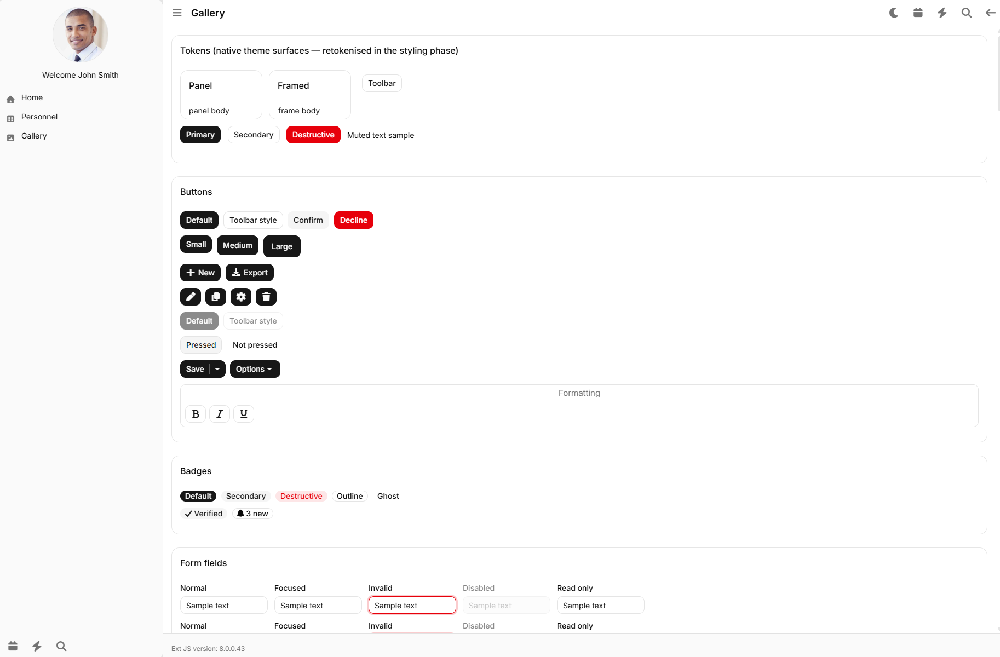</td>
<td width="50%">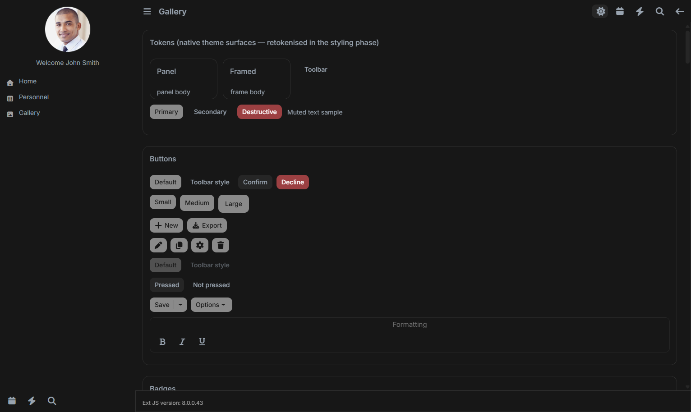</td>
</tr>
<tr>
<td align="center"><sub>Light mode</sub></td>
<td align="center"><sub>Dark mode — one class toggle, no rebuild</sub></td>
</tr>
</table>

---

## Table of contents

- [Why this exists](#why-this-exists)
- [What's in this repository](#whats-in-this-repository)
- [Who this is for](#who-this-is-for)
- [Feature highlights](#feature-highlights)
- [Screenshots — the component gallery](#screenshots--the-component-gallery)
- [The `Re*` component catalogue](#the-re-component-catalogue)
- [Documentation](#documentation)
- [Requirements](#requirements)
- [Installation — using the theme/components in your own Ext JS app](#installation--using-the-themecomponents-in-your-own-ext-js-app)
- [Running this repository's demo app](#running-this-repositorys-demo-app)
- [Usage examples](#usage-examples)
- [Dark mode](#dark-mode)
- [License](#license)
- [Acknowledgements](#acknowledgements)

---

## Why this exists

Ext JS Classic is still how a huge amount of enterprise line-of-business software gets built and
maintained — but its stock themes (Material, Triton, Neutral, Classic) read as unmistakably
"enterprise-2015" next to the flat, minimal, high-contrast design language that shadcn/ui and
Tailwind popularised in the React ecosystem. Teams that maintain an Ext JS app *and* a modern
React app end up with two products that look like they came from two different companies — and
rewriting a mature Ext JS app in React purely for a visual refresh is rarely worth the cost or
risk.

This project closes that gap **without leaving Ext JS**: a theme package that restyles every
native Classic Toolkit control to match the shadcn/ui aesthetic, and a small companion component
package for the handful of modern UI primitives (badges, stat tiles, status pills, avatars, typed
toasts) that Ext JS never had an equivalent for in the first place.

## What's in this repository

| Package | What it is |
|---|---|
| **`packages/local/theme-react-shadcn`** | A Sencha **theme** package (extends the stock `theme-material`) that reskins every native Ext JS Classic control — buttons, fields, grids, trees, tabs, menus, panels, windows, message boxes, date pickers — in the shadcn/ui visual language. Ships full dark-mode support via a single `.dark-mode` class toggle. |
| **`packages/local/ppa-react-ui`** | A Sencha **code** package of `Re*`-prefixed Ext JS components that Ext JS doesn't ship: badges/status pills, stat tiles, avatars, typed toasts, and a full themeable app shell (header bar, sidebar, nav tree, status bar, card surface). Theme-independent by design — looks the same under any Ext JS theme, not just the one above. |
| **`app/desktop/src/view/gallery`** | A one-page **component gallery** (16 sections) that renders every themed native control and every `Re*` component at once, used to visually test and troubleshoot both packages during development. |

## Who this is for

- **Ext JS teams under pressure to "look modern"** who need a visual refresh without a framework
  migration.
- **Organizations running both an Ext JS product and a React/shadcn product** who want the two to
  feel like one design system.
- **Sencha consultants and agencies** who want a reusable, drop-in starting theme instead of
  hand-rolling one per client.
- **Anyone extending Ext JS Classic** who's missing a badge, a stat tile, or a status-colour
  vocabulary and doesn't want to build it from scratch.

## Feature highlights

- 🎨 **Flat, neutral shadcn/ui look** — 1px hairlines instead of drop shadows, 10–14px corner
  radii, Inter typeface, a restrained black/white/grey palette with a five-colour status ramp
  (open / escalated / replied / closed / send-failed, fully replaceable).
- 🌗 **Full dark mode**, toggled with one line of code (`Ext.getBody().toggleCls('dark-mode')`) —
  no rebuild, no second stylesheet.
- 🧩 **A small, focused set of "missing" components** — `ReBadge`, `ReTile`, `ReAvatar`,
  `ReToast`, plus a full app-shell kit (`ReHeaderBar`, `ReSidebar`, `ReNavTree`, `ReStatusBar`,
  `ReCard`).
- 🔌 **Theme-independent components** — the `Re*` package reads its own CSS custom properties, so
  it renders identically under Material, this theme, or any other Ext JS theme.
- 🧪 **A 16-section, 50+ component gallery page** for visual regression-checking every change in
  both light and dark mode.
- 📚 **Deep reference documentation** written for both engineers and AI coding assistants — every
  design token, every component config, every gotcha, documented (see [Documentation](#documentation)).

## Screenshots — the component gallery

All screenshots below are captured from the in-repo gallery page (`#galleryview`), Ext JS
8.0.0.43 Classic Toolkit, running this theme.

<table>
<tr><td></td></tr>
<tr><td align="center"><sub><b>Tokens · Buttons · Badges · Form fields</b> — native surfaces, button variants/sizes/states, <code>ReBadge</code> variants</sub></td></tr>
</table>

<table>
<tr><td>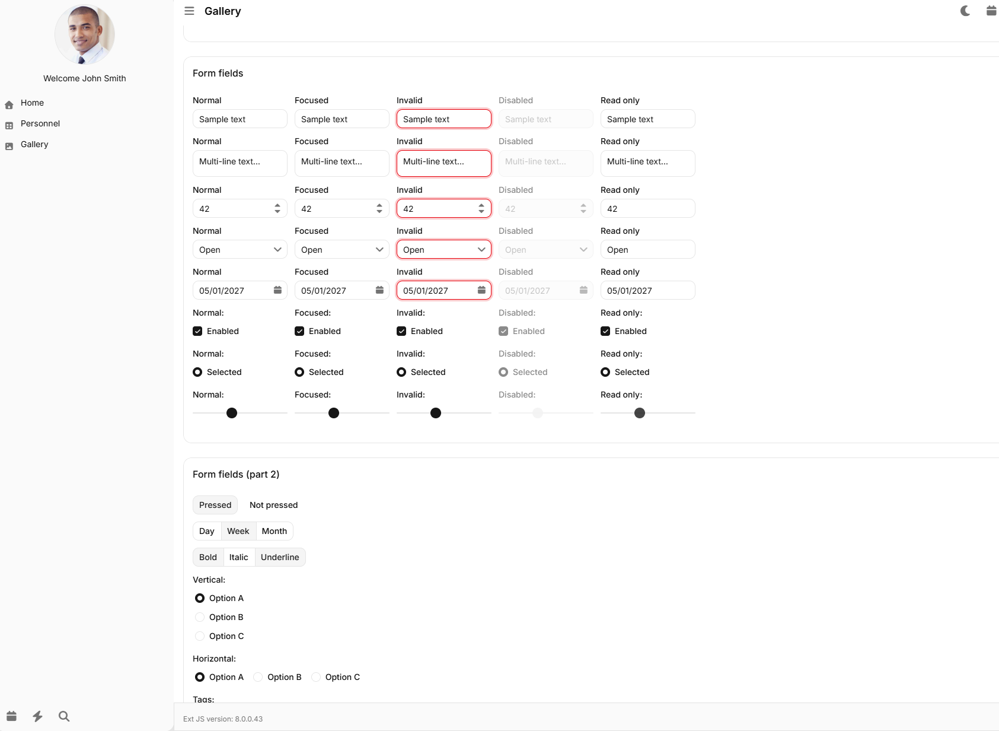</td></tr>
<tr><td align="center"><sub><b>Form fields — every state</b>: normal / focused / invalid / disabled / read-only, across text, number, combo, date, checkbox, radio and slider fields</sub></td></tr>
</table>

<table>
<tr><td>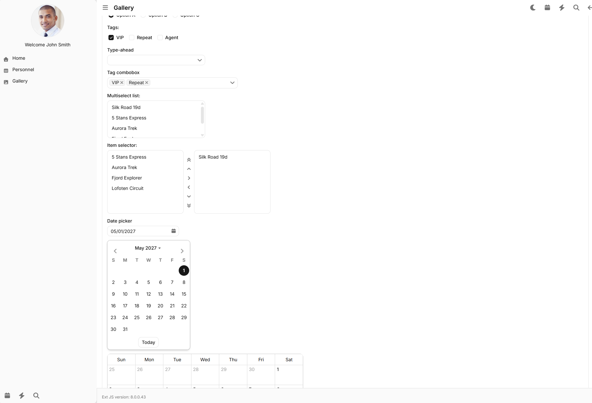</td></tr>
<tr><td align="center"><sub><b>Advanced fields</b>: tag combobox, multiselect list, item selector, inline date picker</sub></td></tr>
</table>

<table>
<tr><td>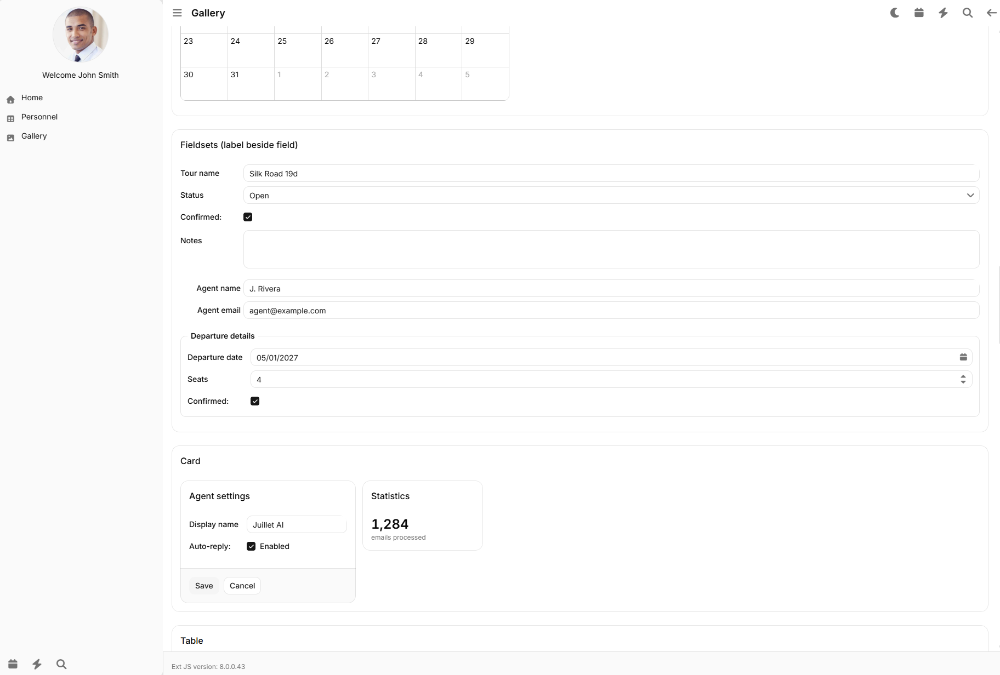</td></tr>
<tr><td align="center"><sub><b>Fieldsets</b> (label-beside-field house style) and <b><code>ReCard</code></b> surfaces — a settings form next to a stat card</sub></td></tr>
</table>

<table>
<tr><td>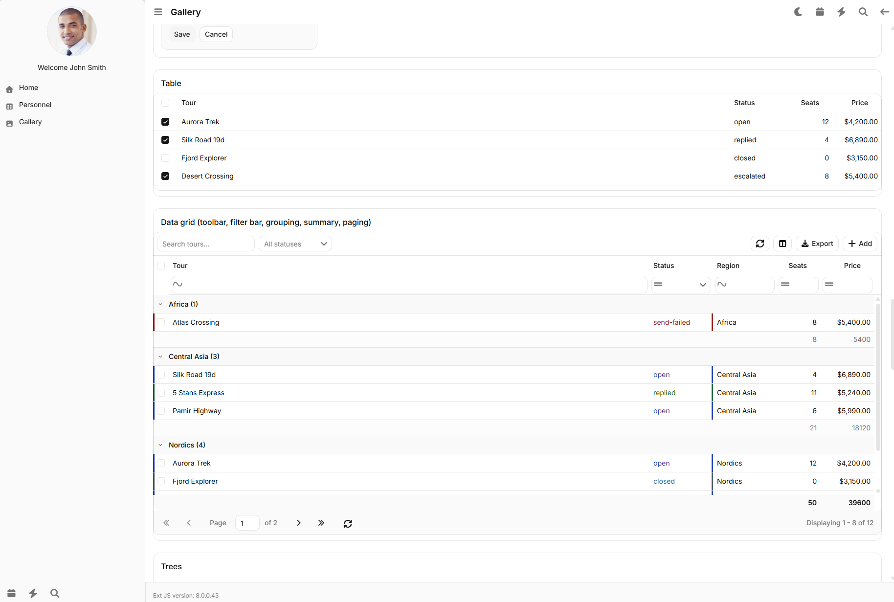</td></tr>
<tr><td align="center"><sub><b>Grids</b>: a plain table, and a full-featured data grid — toolbar, filter bar, grouping, group/grand summaries, paging, all at once</sub></td></tr>
</table>

<table>
<tr><td>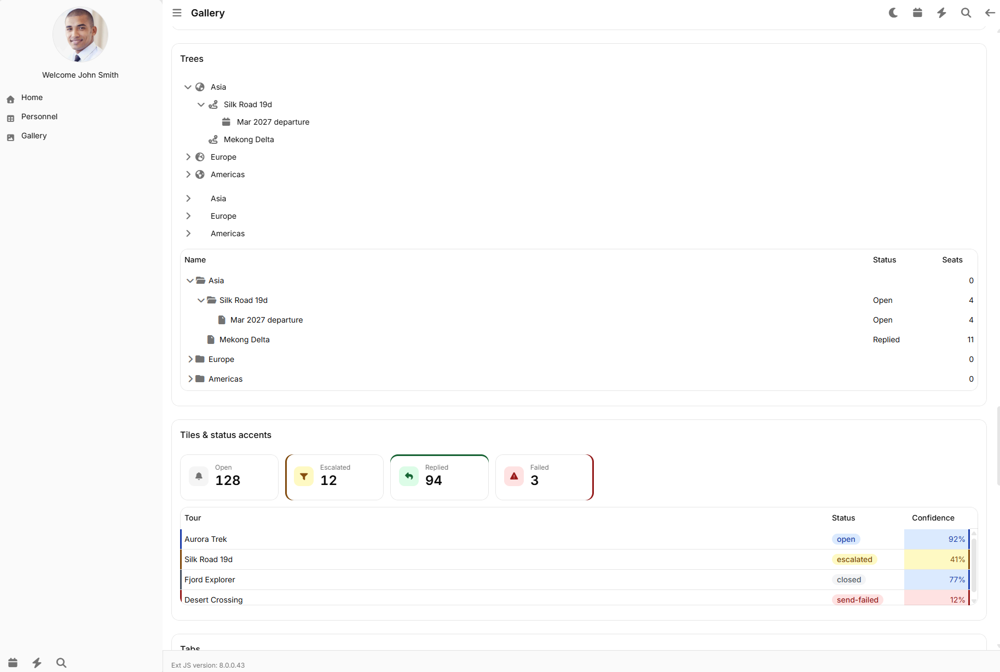</td></tr>
<tr><td align="center"><sub><b>Trees</b> (<code>treelist</code>/<code>treepanel</code>) and <b><code>ReTile</code> stat cards with status-colour accents</b>, plus a grid using the shared status ramp for row/cell colouring</sub></td></tr>
</table>

<table>
<tr><td>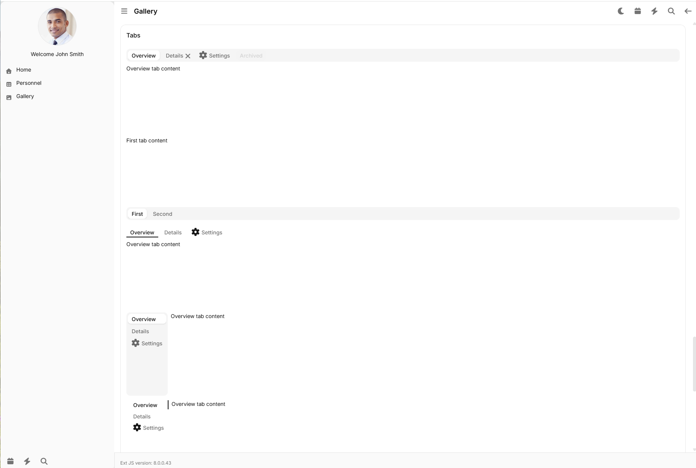</td></tr>
<tr><td align="center"><sub><b>Tabs</b> — top/bottom/vertical positions, filled and plain (underline) variants</sub></td></tr>
</table>

<table>
<tr><td>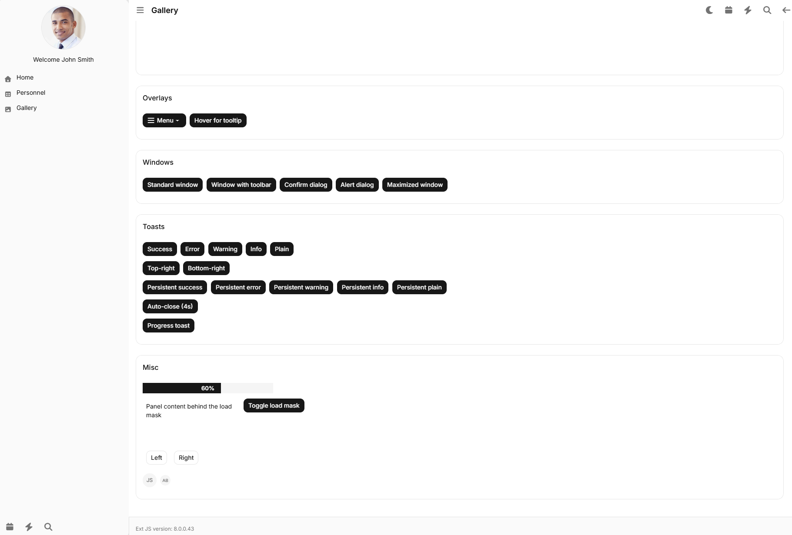</td></tr>
<tr><td align="center"><sub><b>Overlays, windows, <code>ReToast</code> notifications</b> (success/error/warning/info/plain, positioned and persistent), progress bar, load mask, and <code>ReAvatar</code> chips</sub></td></tr>
</table>

### Dark mode

<table>
<tr>
<td width="50%">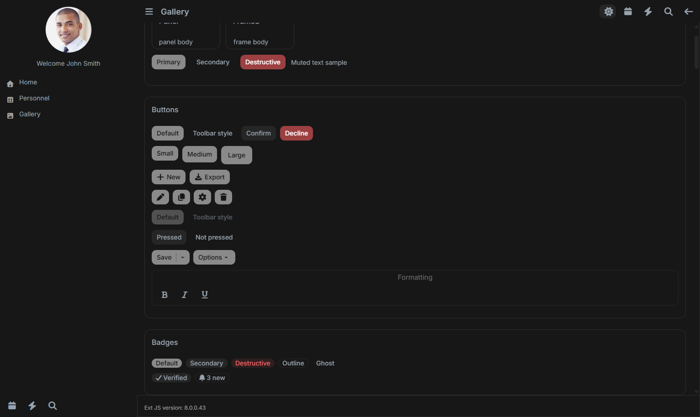</td>
<td width="50%">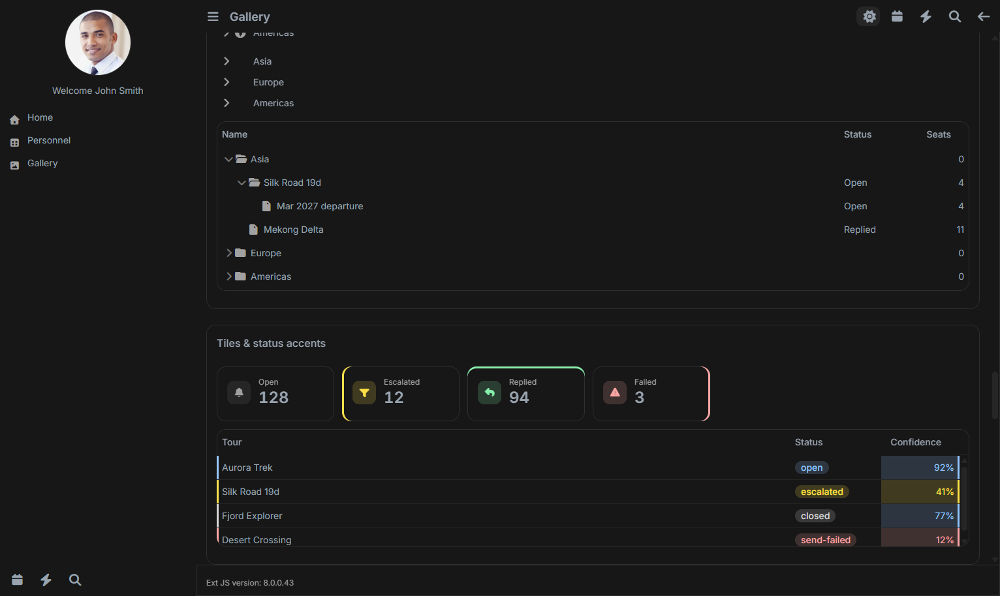</td>
</tr>
<tr>
<td align="center"><sub>Buttons &amp; badges</sub></td>
<td align="center"><sub><code>ReTile</code> stat cards &amp; status-coloured grid</sub></td>
</tr>
</table>

## The `Re*` component catalogue

Every component below lives in `packages/local/ppa-react-ui` (namespace `ppa.react`) and is
**theme-independent** — it looks the same regardless of which Ext JS theme is active. Full
configs, CSS custom properties, and styling details are in the
[component reference doc](docs/ppa-react-ui/PPA_REACT_UI_COMPONENTS_REFERENCE.md).

| Component | xtype | What it's for | See it in |
|---|---|---|---|
| **`ReBadge`** | `rebadge` | Status/tag pill — 5 variants (default, secondary, destructive, outline, ghost) or driven by the shared status ramp | [Badges](docs/theme-react-shadcn/assets/gallery_01.png) · [dark](docs/theme-react-shadcn/assets/dark_badges.png) |
| **`ReStatus`** | *(singleton)* | The shared status-colour vocabulary — colours grid rows, grid cells, badges and tiles from one source of truth | [Data grid](docs/theme-react-shadcn/assets/gallery_06.png) |
| **`ReTile`** | `retile` | Dashboard stat/KPI card — icon chip, label, big number, optional coloured edge accent | [Tiles](docs/theme-react-shadcn/assets/gallery_06.png) · [dark](docs/theme-react-shadcn/assets/dark_tiles.png) |
| **`ReAvatar`** | `reavatar` | Circular initials/photo chip, two sizes | [Misc](docs/theme-react-shadcn/assets/gallery_08.png) (small chips) · sidebar header (photo, all screenshots) |
| **`ReToast`** | `retoast` | Typed toast notification (success/error/warning/info/plain), positioned, persistent or auto-closing | [Toasts](docs/theme-react-shadcn/assets/gallery_08.png) |
| **`ReCard`** | `recard` | Plain, ring-outlined content surface with no header chrome — the base for content panes | [Card](docs/theme-react-shadcn/assets/gallery_04.png) |
| **`ReIconButton`** | `reiconbutton` | Borderless icon-only button with a muted glyph and an accent hover state | Header/sidebar icons in every screenshot |
| **`ReHeaderBar`** | `reheaderbar` | Flat app-shell top header bar | Top bar in every screenshot |
| **`ReSidebar`** / **`ReSidebarHeader`** / **`ReSidebarFooter`** | `residebar` / `residebarheader` / `residebarfooter` | The nav-rail surface, its avatar/header strip, and its footer icon strip | Left column in every screenshot |
| **`ReNavTree`** | `renavtree` | The left navigation tree itself (keeps Ext JS's structural `ui: 'nav'` behaviour, restyles the colours) | Home / Personnel / Gallery tree, left column |
| **`ReStatusBar`** | `restatusbar` | Flat footer/status strip | "Ext JS version: 8.0.0.43" strip at the bottom of every screenshot |
| **`ReContentArea`** | `recontentarea` | Main content background container (routed pages render inside it) | Whole center area, every screenshot |
| **`grid.ReStatusColumn`** | `restatuscolumn` | Drop-in grid column that renders a status badge with zero inline renderer code | Status column, [Tiles &amp; status accents](docs/theme-react-shadcn/assets/gallery_06.png) |

## Documentation

This repo includes reference documentation deep enough to hand to another engineer *or* an AI
coding assistant and have them make correct customization decisions without re-deriving anything
from source:

- 📘 [**Theme reference**](docs/theme-react-shadcn/THEME_REACT_SHADCN_REFERENCE.md) — every design
  token (light + dark) with literal values, a component-by-component variable/rule map, the dark
  mode mechanism, known implementation traps, and a step-by-step guide for **forking a derived
  theme** (e.g. a denser, higher-data-density variant), plus a portability section for reusing the
  theme in another Ext JS app.
- 📗 [**`Re*` component reference**](docs/ppa-react-ui/PPA_REACT_UI_COMPONENTS_REFERENCE.md) — the
  full component catalogue with configs, CSS classes, tokens, and mocked-data code samples; the
  complete `--re-*` token table; the styling/theming model; and a portability section for using the
  components **without** this theme.
- 📙 [**Gallery page reference**](docs/gallery/EXTJS_GALLERY_PAGE_REFERENCE.md) — every gallery
  section and app-shell view described in detail, plus a verification/troubleshooting checklist for
  anyone doing further theme work.
- Historical build-out specs (the *why*, not just the *what*):
  [`docs/EXTJS_THEME_PARITY_SPEC.md`](docs/EXTJS_THEME_PARITY_SPEC.md),
  [`docs/EXTJS_THEME_REMEDIATION_SPEC.md`](docs/EXTJS_THEME_REMEDIATION_SPEC.md),
  [`docs/PPA_REACT_UI_PACKAGE_SPEC.md`](docs/PPA_REACT_UI_PACKAGE_SPEC.md),
  [`docs/EXTJS_GALLERY_SPEC.md`](docs/EXTJS_GALLERY_SPEC.md).

## Requirements

- **Ext JS 8.0.0.43, Classic Toolkit.** This project targets that exact release; the theme and
  components have only been verified against it.
- **A valid Sencha Ext JS commercial license and npm registry access** (`registry.sencha.com`).
  Ext JS is proprietary framework software — this repository provides the *theme and component
  source*, not the framework itself, and `npm install` will not succeed without your own
  licensed access to the `@sencha/*` packages.
- **Sencha Cmd** (installed transitively via `@sencha/cmd`) for the Fashion SCSS compiler.
- **Node.js** for the webpack dev server / build (see `package.json` for the toolchain versions
  used).
- The **`font-awesome`** Sencha package (`@sencha/ext-font-awesome`) — required by the theme for
  several native-control glyphs (window tools, message box icons, tree expanders, field
  triggers). Icons used by the `Re*` components themselves are always consumer-supplied, so no
  icon-font dependency exists there.
- `ext-ux` / `ext-calendar` only if you use the field types they provide (multiselect, item
  selector, calendar panel) — the theme has dedicated styling for both, inert otherwise.

## Installation — using the theme/components in your own Ext JS app

You don't need to run this whole repository to use the theme or the components — both are
self-contained Sencha packages you can copy into any Ext JS 8.0.x Classic app.

### 1. Copy the packages

```powershell
# from this repo, into your app's package folder
Copy-Item -Recurse packages/local/theme-react-shadcn  <your-app>/packages/local/theme-react-shadcn
Copy-Item -Recurse packages/local/ppa-react-ui        <your-app>/packages/local/ppa-react-ui
```

### 2. Wire them into your app's `app.json`

```jsonc
{
  "requires": [
    "font-awesome",   // required by the theme — see Requirements above
    "ppa-react-ui"    // optional — only if you want the Re* components
  ],
  "builds": {
    "desktop": {
      "toolkit": "classic",
      "theme": "theme-react-shadcn"
    }
  }
}
```

### 3. Rebuild

Adding a **brand-new** package to `app.json` requires a full dev-server restart, not just a hot
rebuild:

```powershell
npm run dev
```

That's it — every native Ext JS Classic control in your app now renders in the shadcn/ui style,
and (if you required it) `ppa.react.Re*` xtypes are available to use.

> For the full portability checklist (framework version caveats, the one styling edge case to
> verify under a third-party theme, etc.), see the **Portability** sections in the
> [theme reference](docs/theme-react-shadcn/THEME_REACT_SHADCN_REFERENCE.md#10-portability--using-this-theme-in-another-ext-js-application)
> and the
> [component reference](docs/ppa-react-ui/PPA_REACT_UI_COMPONENTS_REFERENCE.md#5-portability--using-this-package-without-theme-react-shadcn).

## Running this repository's demo app

```powershell
npm install       # requires your own Sencha registry access — see Requirements
npm run dev       # starts webpack-dev-server + Sencha Cmd app watch on http://localhost:1962
```

Then open `http://localhost:1962/#galleryview` to see the full component gallery, or
`http://localhost:1962/` for the app shell (Home / Personnel / Gallery navigation).

## Usage examples

### Badge

```js
{
    xtype: 'rebadge',
    text: 'Verified',
    iconCls: 'x-fa fa-check',
    variant: 'secondary'          // default | secondary | destructive | outline | ghost
}

// Status-driven instead of a fixed variant — colour comes from the shared status ramp
{ xtype: 'rebadge', text: 'Escalated', status: 'escalated' }
```

### Stat tile

```js
{
    xtype: 'container',
    layout: 'hbox',
    defaults: { margin: '0 12 0 0' },
    items: [
        { xtype: 'retile', tileIconCls: 'x-fa fa-bell', label: 'Open',      value: 128 },
        { xtype: 'retile', label: 'Escalated', value: 12, accent: 'left',  status: 'escalated' },
        { xtype: 'retile', label: 'Replied',   value: 94, accent: 'top',   status: 'replied' },
        { xtype: 'retile', label: 'Failed',    value: 3,  accent: 'right', status: 'send-failed' }
    ]
}
```

### Card

```js
Ext.define('MyApp.view.detail.DetailView', {
    extend: 'ppa.react.ReCard',
    xtype: 'detailview',
    bodyPadding: 16,
    html: 'Detail content goes here'
});
```

### Toast

```js
ppa.react.ReToast.show({
    toastType: 'success',      // success | error | warning | info | plain
    title: 'Saved',
    html: 'Tour details updated.',
    align: 'tr'
});
```

More components, every config, and full mocked-data examples (status grid columns, avatars, the
app-shell composition) are in the
[`Re*` component reference](docs/ppa-react-ui/PPA_REACT_UI_COMPONENTS_REFERENCE.md).

## Dark mode

Dark mode is a single class toggle — no second build, no page reload:

```js
Ext.getBody().toggleCls('dark-mode');
```

Both the theme and the `Re*` components repaint immediately from their dark-mode token sets. See
the dark-mode sections of the [theme reference](docs/theme-react-shadcn/THEME_REACT_SHADCN_REFERENCE.md#4-dark-mode)
and [component reference](docs/ppa-react-ui/PPA_REACT_UI_COMPONENTS_REFERENCE.md#24-dark-mode) for
how to repoint the toggle class or retint individual tokens at runtime.

## License

This repository does not currently declare an explicit open-source license for its own
theme/component source (`package.json` inherits the Sencha app-template default of `ISC`) —
if you're opening this repository publicly, add a `LICENSE` file with the license you intend
before publishing. Note that Ext JS itself remains proprietary, commercially-licensed framework
software from Sencha/Idera; this repository distributes only the theme and component *source*
that plugs into it, not the framework.

## Acknowledgements

- [shadcn/ui](https://ui.shadcn.com/) for the design language this theme adapts.
- [Sencha Ext JS](https://www.sencha.com/products/extjs/) for the Classic Toolkit and the
  Material base theme this package extends.